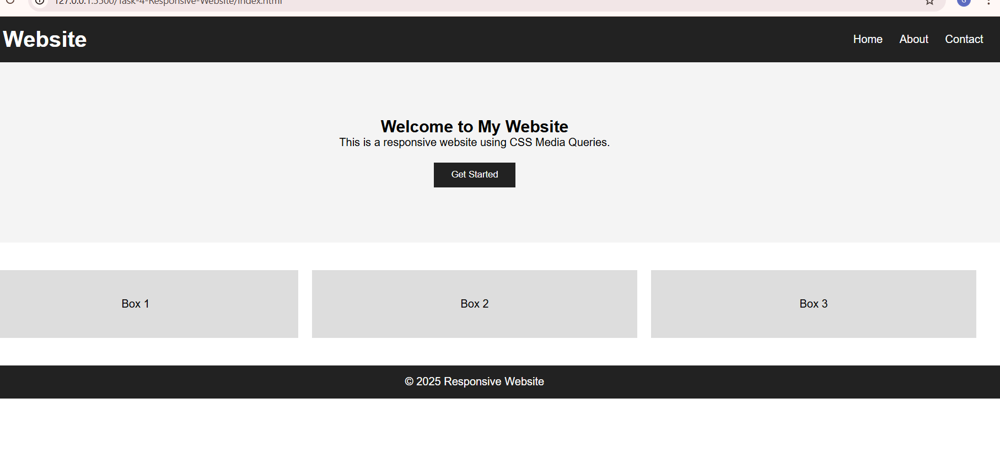
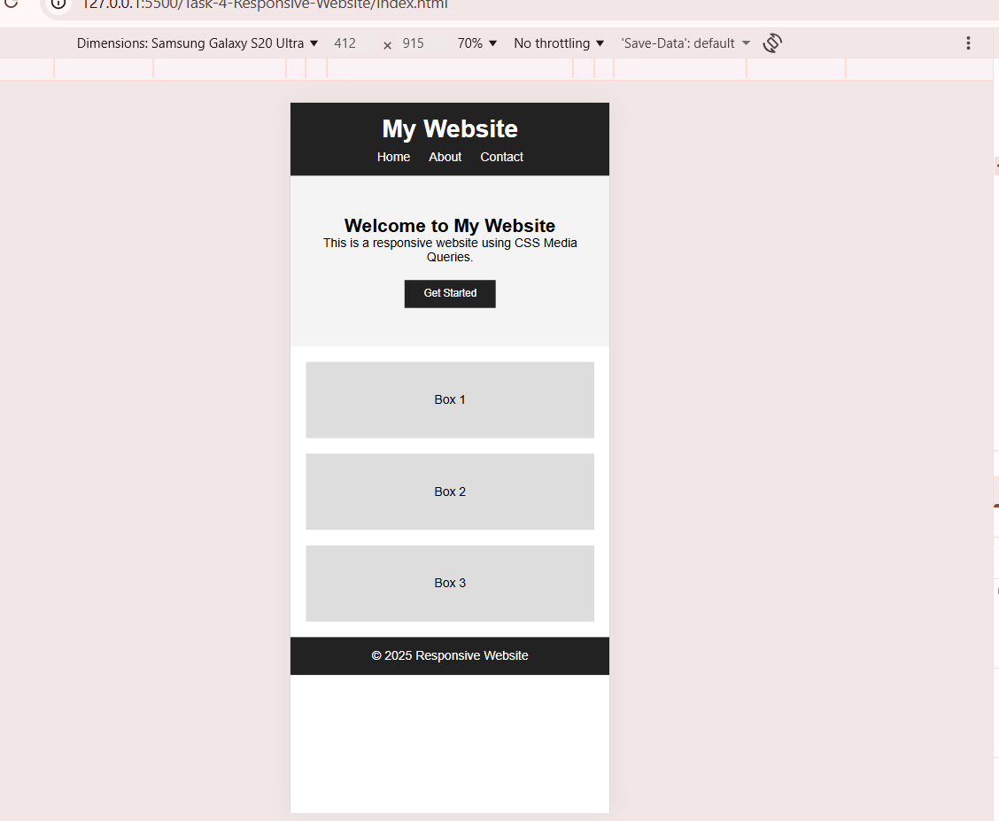

# Task-4-Responsive-Website 

This project converts a desktop-only webpage i nto a mobile-friendly
responsive website using CSS media queries.

## Desktop View

## Mobile View

Features:
- Media query for max-width: 768px
- Responsive layout
- Mobile-friendly design

# Live Demo
https://gunjanvarshney246.github.io/Task-4-Responsive-Website/

